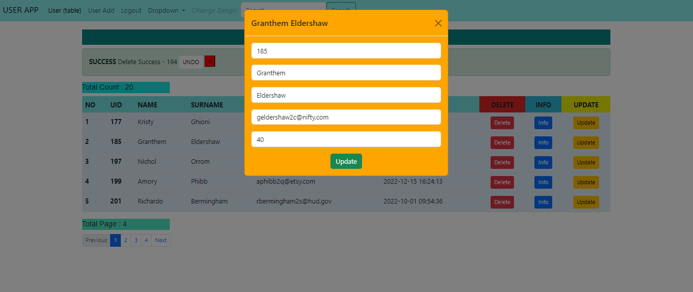
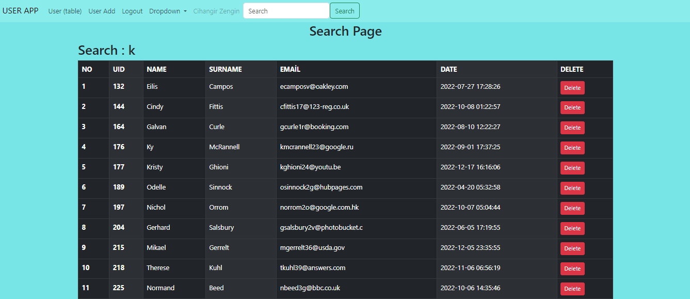

# Spring-MVC-Users-Management
@ -0,0 +1,35 @@
# Spring Mvc Note App
<p> 
Bu Android uygulaması, Bir işletmenin admin kontrollü olarak Kategori, Ürün yada Müşterilerini kontrol ederek tüm mobil kullanıcıları ile etkileşime geçer ve dinamik bir hizmet almasını sağlar.

Uygulamada RestApi Json, SQLite, Firebase Push Notification ve Android SDK Tekonolojileri kullanılmıştır.
</p>

# Yazılım Sürümleri:
- Java 8
- Spring 2.17.3
- Mysql 8
    
# Ugulama Özellikleri:
- [x] Kullanıcı giriş
- [x] Kullanıcı Kayıt
- [x] Ürün Listeleme

## Ugulama Note:
```
Bu uygulama hakkında genel bir not ve açıklama sunar.
```


# Project Life Cycle


# Project Display Image

<p>
<a href="https://github.com/hakanozer/AndroidCampaigns/blob/master/ekran_goruntuleri/1.png" target="_blank">
     
</a>
    <a href="https://github.com/hakanozer/AndroidCampaigns/blob/master/ekran_goruntuleri/1.png" target="_blank">
     
</a>
       <a href="https://github.com/hakanozer/AndroidCampaigns/blob/master/ekran_goruntuleri/1.png" target="_blank">
     
</a>
       <a href="https://github.com/hakanozer/AndroidCampaigns/blob/master/ekran_goruntuleri/1.png" target="_blank">
     
</a>
       <a href="https://github.com/hakanozer/AndroidCampaigns/blob/master/ekran_goruntuleri/1.png" target="_blank">
     
</a>
</p>
